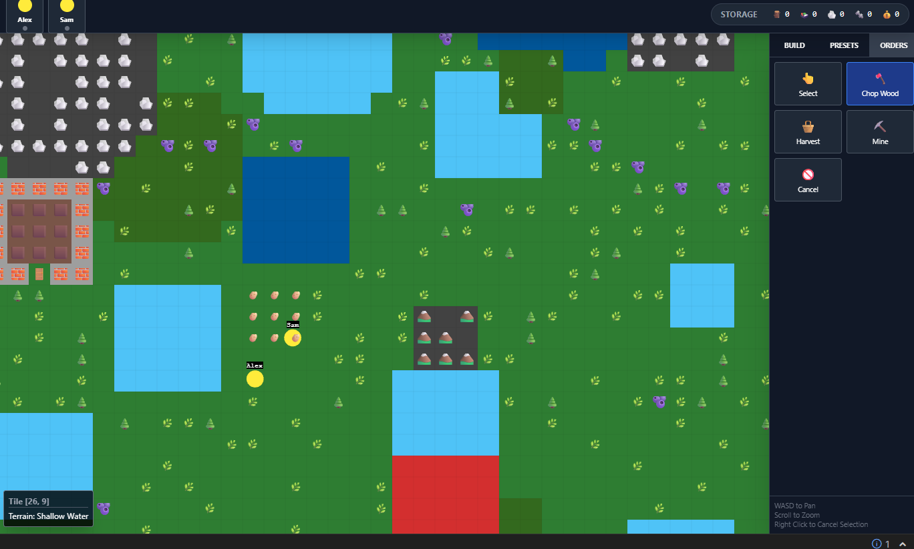

# RimReact Colony Sim

A deep, colony-management simulation game built with **Phaser 3** and **React**. Inspired by titles like RimWorld, this project features complex pawn AI, building mechanics, and a procedurally influenced world.

## 🚀 Features

- **Pawn AI**: Autonomous pawns with needs (Food, Sleep, Recreation) and professional skill sets.
- **Smart Building**: Blueprint-based construction system with automatic clearing of obstructions (trees, rocks).
- **Resource Management**: Mine ores, chop timber, and harvest crops to sustain your colony.
- **Dynamic Map**: 64x64 tile-based environment with varied terrain (Lava, Marsh, Water, Rock).
- **Prefab System**: Quickly deploy pre-designed structures like "Small Cottage" or "Potato Farm".

## 🛠️ Tech Stack

- **Engine**: Phaser 3.90+
- **UI Framework**: React 19 (Hooks, Context-free event bridge)
- **Styling**: Tailwind CSS
- **Pathfinding**: Custom BFS-based navigation for grid-based movement.

## ## Docs

Below is a visual overview of the current gameplay and user interface:

---

### Technical Implementation Notes

- **Event Bridge**: The game uses a custom event emitter to bridge the high-performance Phaser rendering loop with the reactive React UI, ensuring smooth data flow for pawn statuses and inventory.
- **Visuals**: Structures utilize a hybrid rendering approach, combining solid primitive rectangles for "connected" world-building with emoji-based iconography for clear visual metaphors.
- **Auto-Clearing**: When placing blueprints over resources, the engine automatically calculates the necessary prerequisite tasks (Chop/Mine) and queues them for pawns.
